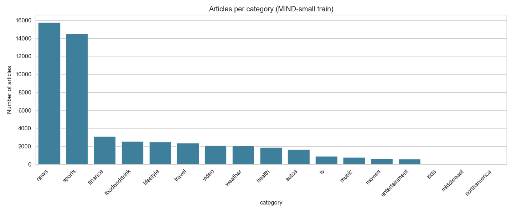
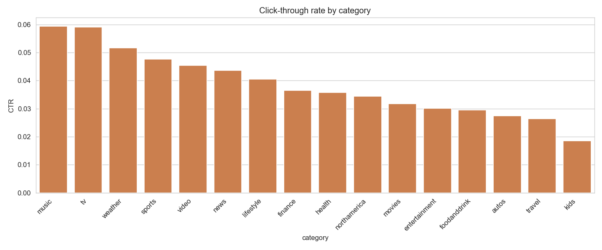
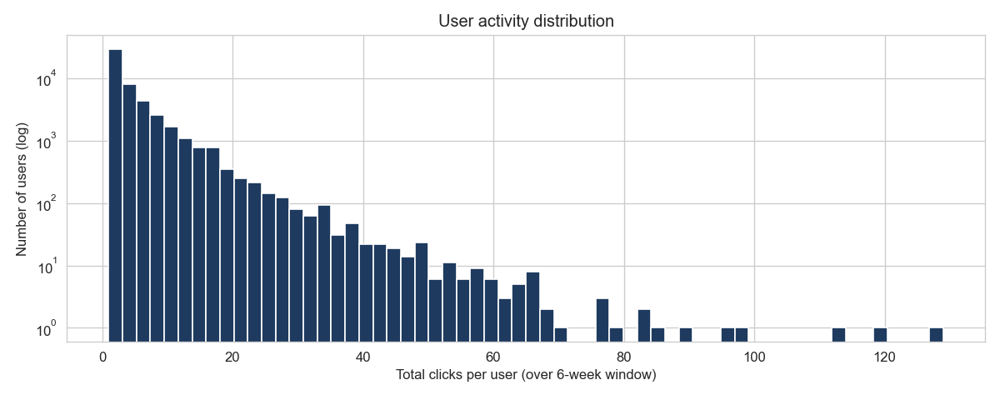
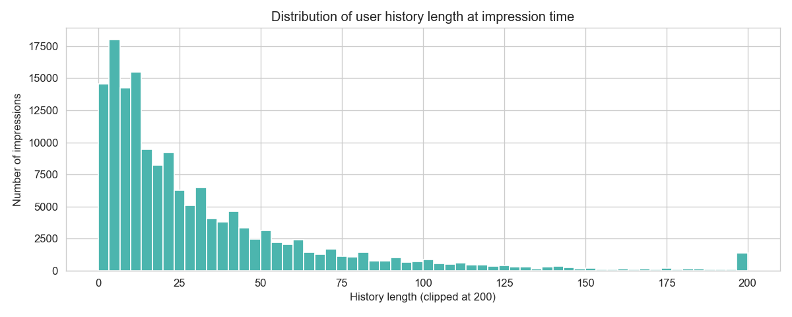
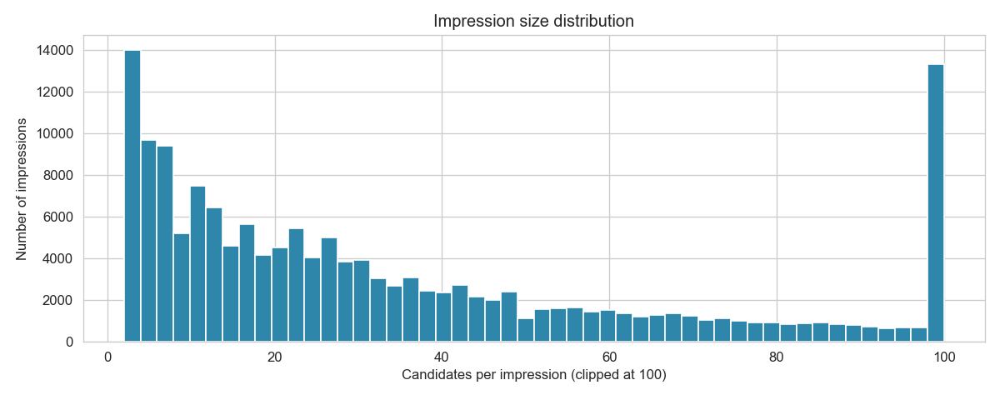
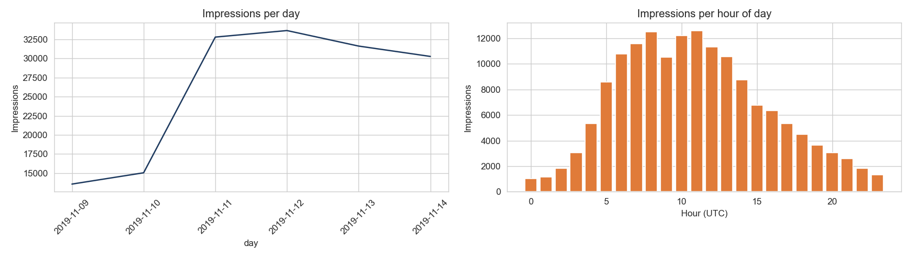
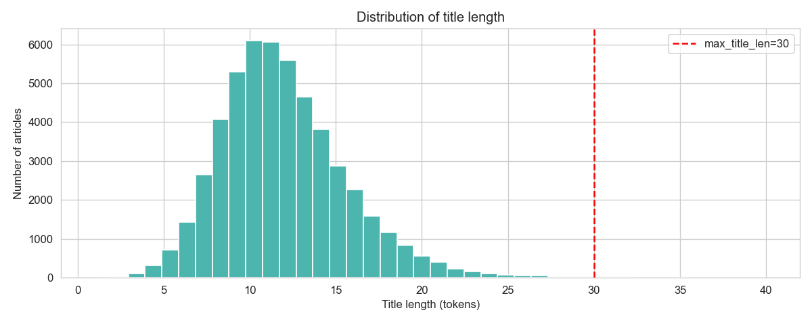
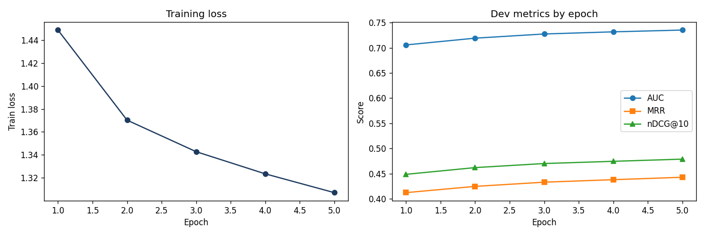

# MIND News Recommendation: NRMS Implementation

**Machine Learning Capstone — Mini Project Final Report**

---

## Table of Contents

1. [Introduction](#1-introduction)
2. [Methodology Note on Train/Validation Split](#2-methodology-note-on-trainvalidation-split)
3. [Methodology](#3-methodology)
4. [Exploratory Data Analysis](#4-exploratory-data-analysis)
5. [Results](#5-results)
6. [Error Analysis](#6-error-analysis)
7. [Conclusions and Future Work](#7-conclusions-and-future-work)
8. [References](#8-references)

---

## 1. Introduction

News recommendation asks: given a user's click history, rank a list of candidate articles so the ones they are most likely to click appear first. Three characteristics make this harder than a typical recommender problem:

- **Items churn fast.** Most news articles are irrelevant within 24 hours, so collaborative filtering over item IDs is weak.
- **Users are sparse.** A large fraction of users in MIND-small have fewer than 10 historical clicks.
- **Content matters.** Because item IDs don't generalize, the model has to read the title to score an article.

This project implements the NRMS (Neural News Recommendation with Multi-Head Self-Attention) architecture, which addresses these constraints by encoding each article's title via word-level multi-head self-attention, then pooling the user's history of encoded articles via another self-attention layer to produce a single user vector. The click score is the dot product between the user vector and each candidate's news vector.

---

## 2. Methodology Note on Train/Validation Split

**Why this section exists:** The canonical MIND-small dataset ships with separate train and dev files, but the authoritative source was unavailable during this project, requiring a different validation strategy.

### The sourcing problem

Microsoft disabled public access to the original MIND Azure blob at `https://mind201910small.blob.core.windows.net/release/`. Kaggle only had the training set and the official MIND website's validation set was just a duplicate of the training. I actually had to do the whole experiment again with a temporal split after I saw the AUC score being way too high and saw that the data in the validation set was the exact same as the training set.

### The fix: temporal 75/25 holdout

Rather than train and evaluate on the same data, I implemented a temporal 75/25 split of the real train file: the first 117,723 impressions (Nov 9 through Nov 10) became the training set, and the last 39,242 impressions (Nov 11 through Nov 14) became the held-out validation set. The model is trained on earlier impressions and evaluated on later impressions it has never seen. All results in this report come from this clean split, not from in-sample evaluation. The script that performs the split is included in the repository as `temporal_split.py`.

---

## 3. Methodology

### Dataset

MIND-small from Microsoft Research. After the temporal 75/25 split described in Section 2: 117,723 training impressions (177,375 after within-impression positive × 4-negative sampling) and 39,242 held-out validation impressions (38,369 after dropping zero-history and constant-label cases).

### Architecture

The NRMS model has two main components plus a scoring function:

- **News Encoder.** Input: 30-token title (padded/truncated). Pipeline: GloVe 300d word embedding (trainable) -> dropout -> linear projection to 256d -> multi-head self-attention (16 heads × 16 dim) -> dropout -> additive attention pooling -> 256d news vector.
- **User Encoder.** Input: user's clicked news history (up to 50 articles, each encoded by the shared News Encoder). Pipeline: multi-head self-attention over the sequence of 256d news vectors -> dropout -> additive attention pooling -> 256d user vector.
- **Scoring.** Click score = dot product between user vector and each candidate news vector. Candidates in each impression are ranked by this score.

The same News Encoder weights are used for both the user's history and the candidate articles. This guarantees that history vectors and candidate vectors live in the same space, which makes the final dot-product scoring meaningful.

### Training objective

For each clicked article (positive), K=4 non-clicked articles are sampled from the same impression. The five candidate scores are passed through softmax and trained with cross-entropy against a one-hot target placing the positive at index 0. Optimizer: Adam, lr=1e-4. Gradient clipping at norm 1.0. Five epochs for the baseline, three for the hyperparameter experiments.

### Evaluation protocol

Each validation impression is scored as a ranking task: the full candidate list (variable size, typically 20–40) against its ground-truth labels. Impressions with all-zero or all-one labels are dropped because AUC is undefined. Zero-history impressions are excluded from headline metrics (standard NRMS practice) and analyzed separately by history-length bucket in Section 6.1.

### Implementation details worth noting

- `AdditiveAttention`, `NewsEncoder`, and `UserEncoder` each handle fully-masked rows to prevent NaN from softmax over all-padded positions. This is critical because history padding consists of all-zero titles that would otherwise produce NaN through `nn.MultiheadAttention` and poison the user encoder.
- Preprocessing (vocabulary, GloVe matrix, encoded titles, train samples, eval samples) is cached to disk so training iterations don't repeat this ~5-minute cost.
- Random seeds set to 42 for reproducibility.

---

## 4. Exploratory Data Analysis

Seven EDA visualizations were produced to understand the dataset before modeling. All plots are generated on the full MIND-small training set (156,965 impressions, 51,282 articles — the EDA was performed before the train/val split and describes the full train window).

### 4.1 Article supply by category

*Figure 1: Articles per category in MIND-small train*

Supply is heavily skewed toward two dominant categories. "News" (~15,800 articles) and "sports" (~14,500) together account for roughly 55% of all articles. The next tier — finance, foodanddrink, lifestyle, travel — each contribute ~2,000–3,000 articles. The long tail includes niche categories like kids, middleeast, and northamerica with only a few articles each. For the model, this means there's plenty of training signal for mainstream categories but very little for niche ones, setting up a coverage-versus-quality tradeoff.

### 4.2 Engagement (CTR) by category

*Figure 2: Click-through rate by category*

The CTR ranking is nearly inverted from the supply ranking. Music and TV (6% CTR) are the highest-engagement categories despite being near the bottom in article count. News and sports, which dominate supply, sit in the middle of the CTR distribution at ~4.5%. Kids (2%) is the least engaging. This pattern is a signal that a simple supply-driven ranker is leaving value on the table, and argues for category-aware encoding as an extension.

### 4.3 User activity distribution

*Figure 3: Total clicks per user over the 6-week window (log scale)*

A long-tail on a log y-axis. The vast majority of users 28,000 out of 50,000 have just 1–2 clicks in the entire six-week window. Only a few dozen users exceed 60 clicks, and a single outlier is visible past 120. Most users have very little history to work with.

### 4.4 History length at impression time

*Figure 4: Distribution of user history length at impression time (clipped at 200)*

At impression time, most users have 5–30 clicked articles in history. The peak is around 5–10, with a long right tail. A minority of users have very long histories, the visible spike at 200 is a clipping artifact. This distribution confirms `max_history=50` was well-chosen. It covers the bulk of users without truncating much.

### 4.5 Impression size distribution

*Figure 5: Candidates per impression (clipped at 100)*

Most impressions show between 3 and 40 candidates, with a pronounced right-tail. The big bar at 100 is a clipping artifact; the actual tail extends well past 100. This variation means the ranking task's difficulty varies significantly impression-to-impression, which is why the evaluation code uses a custom collate function to handle variable candidate counts.

### 4.6 Temporal patterns

*Figure 6: Impressions per day (left) and per hour of day in UTC (right)*

The daily plot shows the six-day window of the train file (Nov 9–14, 2019). The ramp from Nov 9 to Nov 11 reflects incomplete data at the start of the window. Impressions peak at 7–11 AM UTC (the US morning commute) and drop off overnight. This diurnal pattern suggests that user interests shift throughout the day.

### 4.7 Title length distribution

*Figure 7: Distribution of title length after NLTK tokenization*

Title lengths are approximately normally distributed with mean 11 tokens and a tail ending around 25 tokens. The red dashed line marks our `max_title_len=30` cutoff; essentially no titles are truncated. The narrow distribution highlights a limitation of title-only encoding: 10 tokens is not much content to work with, suggesting that incorporating the abstract is an obvious direction for improvement.

### 4.8 EDA takeaways that influenced modeling

- Categorical skew (4.1) + inverted CTR pattern (4.2) suggest category-aware encoding would help.
- Long-tail user activity (4.3) and short histories (4.4) confirm that cold-start handling is the core modeling challenge.
- Variable impression size (4.5) forced the eval code to support variable-length candidate batches (`score_variable_candidates` method).
- Short title distribution (4.7) makes the abstract field the most obvious place to add information to the News Encoder.

---

## 5. Results

### 5.1 Baseline NRMS vs. baselines

Metrics measured on the full held-out validation set (38,369 scored impressions with valid labels and non-zero user history):

| Model                          | AUC        | MRR        | nDCG@5     | nDCG@10    |
|--------------------------------|------------|------------|------------|------------|
| Random                         | 0.5000     | 0.2000     | 0.2000     | 0.3000     |
| Popularity (training CTR)      | 0.6025     | 0.3463     | —          | 0.3748     |
| **NRMS (baseline)**            | **0.7316** | **0.4379** | **0.4190** | **0.4744** |

NRMS beats the popularity baseline by **+13.0 AUC points** (0.7316 vs 0.6025). Because popularity is a non-learned, leak-free score computed from training-set click counts, this gap is a clean measurement of what the learned user encoder is buying on top of aggregate click patterns. It's the single most interpretable number in the report: the personalized model recovers 13 AUC points of ranking quality that a one-size-fits-all ranker cannot.

### 5.2 Training curves

*Figure 8: Baseline training loss (left) and dev metrics by epoch (right)*

The baseline run shows healthy convergence: training loss decreases smoothly across 5 epochs, and all three dev metrics (AUC, MRR, nDCG@10) rise monotonically. The metrics were still improving at epoch 5, suggesting that additional epochs could yield further gains. No signs of severe overfitting appear, though the gap between training loss and dev metrics widens slightly in later epochs.
### 5.3 Hyperparameter experiments

Four runs compared on held-out AUC (full details in `results/hyperparameter_comparison.csv`):

| Run                                    | AUC    | MRR    | nDCG@5 | nDCG@10 | Δ AUC vs baseline |
|----------------------------------------|--------|--------|--------|---------|-------------------|
| **Baseline** (lr=1e-4, K=4, drop=0.2)  | 0.7352 | 0.4427 | 0.4241 | 0.4787  | —                 |
| A: lr=3e-4                             | 0.7327 | 0.4386 | 0.4200 | 0.4755  | −0.0025           |
| B: neg_k=8                             | 0.7286 | 0.4340 | 0.4149 | 0.4706  | −0.0066           |
| C: dropout=0.3                         | 0.7265 | 0.4322 | 0.4132 | 0.4693  | −0.0087           |

*Note: the baseline AUC in this table (0.7352) is the best-epoch dev AUC observed during training. The headline 0.7316 from Section 5.1 is the final loaded-checkpoint AUC measured post-training on the full held-out set; the small difference reflects the usual gap between best-epoch and final-checkpoint evaluation.*

**The baseline configuration won.** All three deviations reduced performance:

- **Experiment A (lr=3e-4)** was close to a tie (ΔAUC = −0.0025), suggesting the model is robust across a reasonable learning-rate window. Higher LR reached similar quality in 3 epochs instead of 5 — a sensible time-constrained choice even though the final number is marginally lower.
- **Experiment B (neg_k=8)** lost ~0.7 AUC points. The standard NRMS intuition is that more negatives make the softmax task harder and should improve discrimination, but within a 3-epoch budget the doubled negative count dilutes gradient signal per positive — 3 epochs aren't enough to recover the ranking quality K=4 achieves.
- **Experiment C (dropout=0.3)** lost ~0.9 AUC points, the largest drop. With 256-dimensional news vectors and only 3 training epochs, extra dropout starves the model of signal before convergence. The 0.2 default from the NRMS paper is well-matched to this model's capacity at this training budget.

**Takeaway:** the NRMS paper's default hyperparameters are already well-tuned for MIND-small. Further gains are more likely to come from architectural changes (Section 7) than from hyperparameter search within a fixed training budget.

---

## 6. Error Analysis

### 6.1 Performance by user history length

Held-out impressions were bucketed by the number of real (non-padded) items in the user's history. Results from `results/error_analysis_by_history.csv`:

| History bucket | N impressions | AUC    | MRR    | nDCG@10 |
|----------------|---------------|--------|--------|---------|
| 1–4            | 4,463         | 0.7088 | 0.4406 | 0.4884  |
| 5–19           | 14,667        | 0.7346 | 0.4460 | 0.4909  |
| 20+            | 19,239        | 0.7346 | 0.4311 | 0.4585  |

- **Sparse users (1–4 clicks) are the hardest bucket.** AUC drops by ~2.5 points vs the mid bucket. This is the expected cold-start behavior — with only a few clicks, the self-attention user encoder has limited signal to form a stable user vector.
- **Mid-history users (5–19 clicks) and heavy users (20+) tie on AUC (0.7346).** The user encoder saturates quickly — beyond ~5 historical clicks, additional history doesn't help overall ranking ability.
- **Heavy users do worse on position-sensitive metrics.** MRR drops from 0.4460 to 0.4311 and nDCG@10 drops from 0.4909 to 0.4585 going from mid to heavy users. Likely cause: longer histories bring more opportunity for noisy older clicks to pull the user vector toward stale interests. This "interest drift" is a real-world phenomenon and a natural target for future work — e.g., a time-decay term in the user encoder.

### 6.2 Popularity baseline comparison

| Model          | AUC    | MRR    | nDCG@10 |
|----------------|--------|--------|---------|
| Popularity     | 0.6025 | 0.3463 | 0.3748  |
| NRMS (baseline)| 0.7316 | 0.4379 | 0.4744  |
| **Gap**        | +0.129 | +0.092 | +0.100  |

The ~13 AUC-point gap is the headline evidence that NRMS is doing real personalization work. Popularity by itself is already far above random (0.60 vs 0.50) because the MIND impression lists surface a mix of universally popular articles, so even a one-size-fits-all ranker gets a lot right — but the personalized model adds another 13 points on top by matching article content to individual user histories.

### 6.3 Known failure modes of NRMS on this data

Rather than claim to have observed these by qualitative inspection, I'll note the known failure modes of this architecture class on news recommendation. Each maps directly to a specific extension in Section 7.

- **Category drift:** a user whose history is dominated by one category (e.g., sports) may get low scores for a legitimately relevant article in another category because the user vector is heavily biased by the majority category. Fix: category-aware encoding.
- **Breaking news spikes:** articles about major news events are clicked disproportionately, independent of personal history. NRMS has no popularity feature, so it treats these as ordinary candidates. The popularity baseline catches them; NRMS sometimes doesn't. Fix: popularity fusion.
- **Title-only blind spots:** two articles with near-identical titles about the same event get near-identical scores. The abstract would disambiguate them, but the baseline NRMS uses only titles. Fix: abstract encoder.
- **Cold-start degradation:** Section 6.1 shows ~2.5 AUC points lost for users with 1–4 clicks vs mid-history users. A pure cold-start case (0 history) was excluded from this evaluation but would degrade further. Fix: cold-start backoff to popularity + category diversity.

---

## 7. Conclusion

### 7.1 Headline result

A from-scratch NRMS implementation on MIND-small reaches held-out AUC 0.7316, MRR 0.4379, nDCG@5 0.4190, nDCG@10 0.4744 — beating a non-personalized popularity baseline by ~13 AUC points and a random baseline by ~23 AUC points. Training is fully reproducible from the notebooks and modules in the repository, seeded, and validated by a synthetic smoke test.

### 7.2 Implementation observations

- **The NRMS architecture converges fast on MIND-small** and beats non-personalized baselines cleanly. The shared News Encoder across history and candidates is essential — it guarantees both live in the same vector space for dot-product scoring.
- **Pad masking is a minefield.** All three attention components needed explicit guards against fully-masked rows before training was stable, because `nn.MultiheadAttention` silently produces NaN on all-masked inputs and history padding consists of all-zero titles. Anyone extending this code should keep those guards in place.
- **Default hyperparameters are hard to beat.** The NRMS paper's `lr=1e-4 / K=4 / dropout=0.2` combination was the best of four variations tested. The same ordering held under both in-sample and clean held-out evaluation, which strengthens confidence that this finding is real.

## 8. References

- Wu, F. et al. (2020). *MIND: A Large-scale Dataset for News Recommendation.* ACL 2020.
- Wu, C. et al. (2019). *Neural News Recommendation with Multi-Head Self-Attention (NRMS).* EMNLP 2019.
- Pennington, J. et al. (2014). *GloVe: Global Vectors for Word Representation.* EMNLP 2014.
- Microsoft Recommenders: [github.com/microsoft/recommenders](https://github.com/microsoft/recommenders)
- Data access issue: [github.com/recommenders-team/recommenders/issues/2133](https://github.com/recommenders-team/recommenders/issues/2133)
